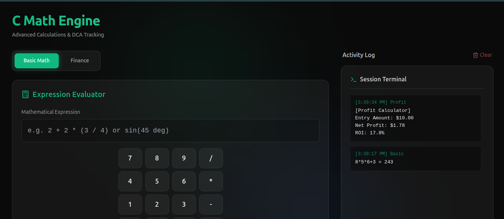
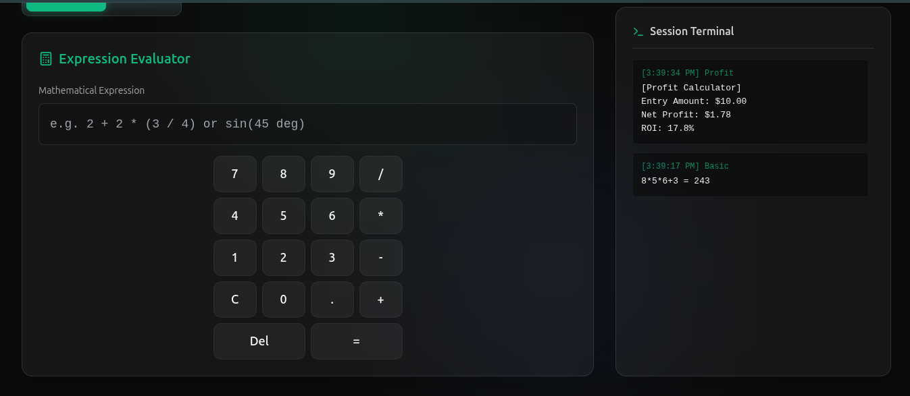
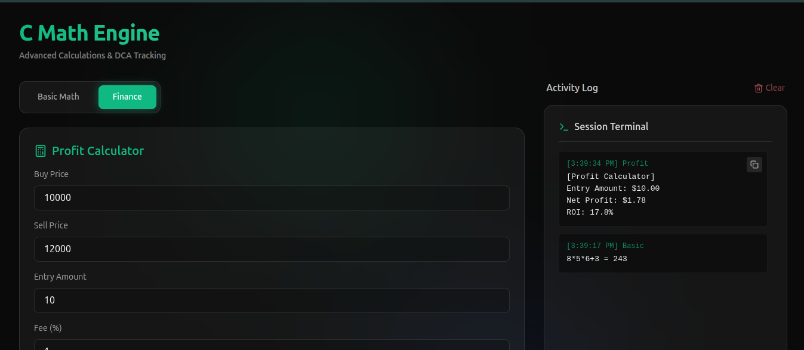
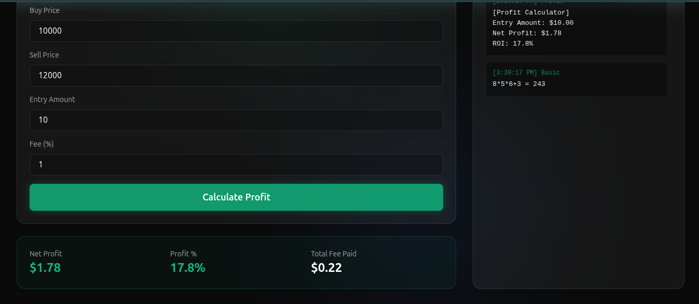

# C Math 🧪

[](https://github.com/Curzyori/C-Math-5)
[](https://opensource.org/licenses/MIT)

**C Math** is a precision-engineered calculator and financial engine built for power users. It combines a sleek, modern aesthetic with robust mathematical accuracy, featuring specialized modules for profit calculations and DCA (Dollar Cost Averaging) tracking.

---

## 📸 Preview

| Mathematical Engine | Calculation Workflow |
| :---: | :---: |
|  |  |
| **Financial Analysis** | **Profit Optimization** |
|  |  |

---

## ✨ Features

- **🚀 Advanced Math Engine**: Handles everything from basic arithmetic to complex expressions with high precision using `mathjs`.
- **💰 Finance Hub**: Specialized tools for calculating profit margins, ROI, and DCA strategies.
- **📜 Session History**: Automatic activity logging so you never lose track of your previous calculations.
- **🌌 Curzy Aesthetic**: A premium dark-mode interface with glassmorphism, neon accents, and smooth animations.
- **📱 Responsive Design**: Fully optimized for both desktop and mobile workflows.

---

## 🛠️ Tech Stack

- **Core**: [React 19](https://react.dev/) + [Vite](https://vitejs.dev/)
- **Styling**: [Tailwind CSS](https://tailwindcss.com/)
- **Animation**: [Framer Motion](https://www.framer.com/motion/)
- **Math Logic**: [mathjs](https://mathjs.org/)
- **Icons**: [Lucide React](https://lucide.dev/)

---

## 🚀 Getting Started

### Prerequisites

- [Node.js](https://nodejs.org/) (v18 or higher recommended)
- npm or yarn

### Installation

1. **Clone the repository**
   ```bash
   git clone https://github.com/Curzyori/C-Math-5.git
   cd C-Math-5
   ```

2. **Install dependencies**
   ```bash
   npm install
   ```

3. **Start the development server**
   ```bash
   npm run dev
   ```

4. **Build for production**
   ```bash
   npm run build
   ```

---

## 📖 Tutorial: How to Use

### 1. Basic Calculation
Simply type your expression or use the custom keypad. Press `Enter` or `=` to get the result. All results are saved to your **Activity Log** on the right.

### 2. Financial Profit
Switch to the **Finance Panel** to calculate your gains. Input your buying price, selling price, and volume to see your net profit and percentage increase instantly.

### 3. Managing History
Your history is saved within the current session. You can click on any previous result to re-import it into the engine, or use the **Clear** button to wipe the log.

---

## 👤 Author

**Curzyori**
- GitHub: [@Curzyori](https://github.com/Curzyori)

---

## 📄 License

This project is licensed under the MIT License - see the [LICENSE](LICENSE) file for details.
